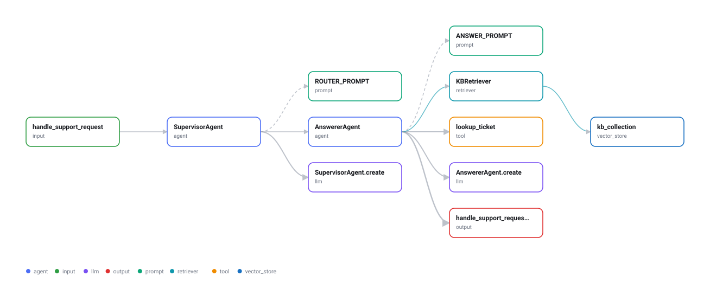
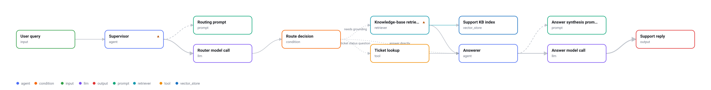
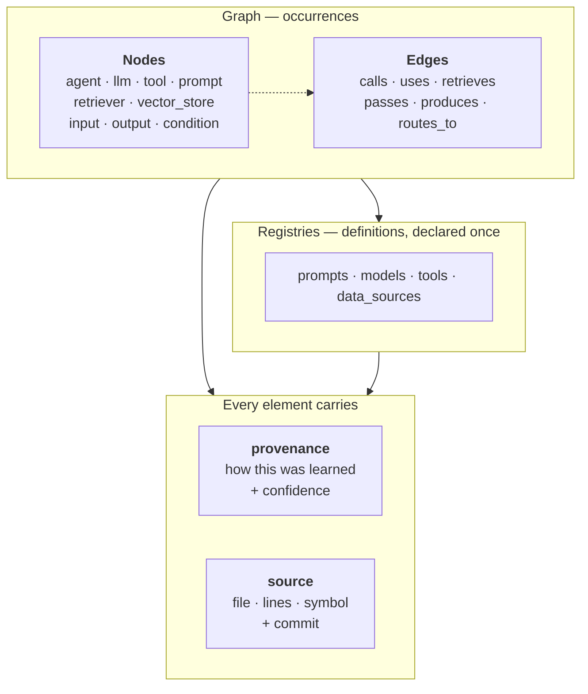
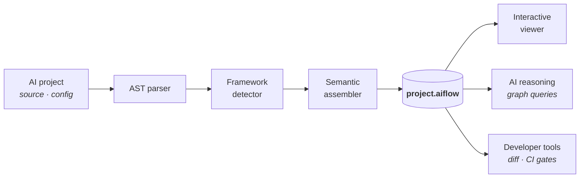

<h1 align="center">AIFLOW</h1>

<p align="center">
  <strong>A framework-independent file format for the semantic structure of AI workflows.</strong>
</p>

<p align="center">
  <a href="https://github.com/AyushSinghRana15/AIFLOW/actions/workflows/ci.yml"></a>
  
  <a href="spec/SPEC.md"></a>
  <a href="LICENSE"></a>
</p>

<p align="center">
  <picture>
    <source media="(prefers-color-scheme: dark)" srcset="docs/generated-dark.svg">
    
  </picture>
</p>

<p align="center"><sub>Not hand-drawn. This is <code>aiflow generate</code> run against the Python project in <a href="examples/sample-project"><code>examples/sample-project</code></a>.</sub></p>

---

`.aiflow` is **not** a diagram file. It is the semantic representation of an AI
workflow that *can* be rendered as a diagram.

## Contents

- [The problem](#the-problem) · [Quick start](#quick-start) · [Guide](#guide)
- [The format](#the-format) · [What makes it different](#what-makes-it-different)
- [Library API](#library-api) · [Architecture](#architecture)
- [Claude Code plugin](#claude-code-plugin) · [Development](#development) · [Roadmap](#roadmap)

## The problem

AI workflows are scattered across code, Markdown, Mermaid, YAML, framework graphs,
and diagram tools. None of them connects:

```
components → relationships → data flow → behavior → source code → AI context
```

Diagrams drift from code the day after they are drawn. Framework graphs do not
survive a framework change. Neither can be queried by a model. AIFLOW is one
machine-readable graph that holds all six, and knows where each claim came from.

## Quick start

```bash
pip install aiflow-format
```

Point it at a Python project and look at what comes back:

```bash
aiflow view ./my-ai-project
```

That analyzes the source, builds the graph, and opens it in your browser. To keep
the document:

```bash
aiflow generate ./my-ai-project -o project.aiflow
aiflow validate project.aiflow --strict
```

<details>
<summary>Install from source</summary>

```bash
git clone https://github.com/AyushSinghRana15/AIFLOW.git
cd AIFLOW
pip install -e .
aiflow --version
```
</details>

## Guide

| Command | What it does |
|---|---|
| [`aiflow view`](#aiflow-view) | Analyze a project (or open a document) and show it in a browser |
| [`aiflow generate`](#aiflow-generate) | Extract a `.aiflow` from a Python project |
| [`aiflow validate`](#aiflow-validate) | Check a document, structurally and semantically |
| [`aiflow inspect`](#aiflow-inspect) | Ask behavioral questions about a workflow |
| [`aiflow enrich`](#aiflow-enrich) | Add inferred semantics with a model, under a call budget |
| [`aiflow render`](#aiflow-render) | Write an interactive page or a static SVG |
| [`aiflow diff`](#aiflow-diff) | Compare two documents semantically |
| [`aiflow init`](#aiflow-init) | Start a document by hand |

### `aiflow view`

The one command worth remembering. Give it a source tree or a `.aiflow` file.

```bash
aiflow view ./my-ai-project              # analyze, then open in a browser
aiflow view project.aiflow               # open an existing document
aiflow view . --save project.aiflow      # keep the extracted document too
aiflow view . -o diagram.svg --no-open   # static SVG instead of a page
```

Output format follows the extension: `.svg` writes a static diagram, anything else
writes the interactive page.

### `aiflow generate`

```bash
$ aiflow generate examples/sample-project
wrote project.aiflow
  analyzed 8 file(s) -> 11 nodes, 10 edges
  agent=2, input=1, llm=2, output=1, prompt=2, retriever=1, tool=1, vector_store=1
  note branching is not extracted by static analysis; add condition nodes by hand
```

It walks the syntax tree and extracts agents, LLM calls, prompts, tools, retrievers,
vector stores, and the data flow between them — with a source reference and a
confidence on every claim.

> **What it will not do.** It reports what the syntax tree shows and nothing else.
>
> - A class becomes an `agent` because it **contains an LLM invocation**, never
>   because it is named `SupervisorAgent`. There is a test asserting exactly that.
> - Two components are linked by `passes` only when a later call **provably consumes**
>   a value an earlier one produced — not because they sit in the same function.
> - It emits **no `ai_context` at all**. Intent, summaries, and failure modes belong
>   to the semantic analyzer; asserting them here would put guesses behind a label
>   that means *parsed*.
> - Where it cannot see — runtime-assembled graphs, branching — it says so instead of
>   emitting a graph that reads as complete.

Supported out of the box: Anthropic, OpenAI, Google, Bedrock · Chroma, Pinecone,
Qdrant, Weaviate, FAISS, pgvector · FastAPI/Flask entrypoints · `@tool`-style
decorators and tool schema literals. Rules live in
[`aiflow/analyze/signatures.py`](aiflow/analyze/signatures.py) as a table — adding a
provider is a data edit.

#### Framework adapters

Generic analysis cannot see *topology* — `add_conditional_edges` means "branch here"
only if you know LangGraph. When a framework is detected, its adapter runs and
contributes what only it can:

```
$ aiflow generate examples/langgraph-project
  analyzed 7 file(s) -> 12 nodes, 13 edges
  agent=3, condition=1, input=1, llm=2, output=1, prompt=2, retriever=1, vector_store=1
  adapter  langgraph -> aiflow-adapter-langgraph
```

Note the `condition=1`. **Adapters are the only component allowed to emit `condition`
nodes and `routes_to` edges**, because they are the only one that does not have to
guess — and they claim `framework_adapter` provenance to say so.

| Framework | Status |
|---|---|
| LangGraph | ✅ |
| LangChain · OpenAI Agents SDK · CrewAI · LlamaIndex | planned |

Adding one is a self-contained job: see [`docs/ADAPTERS.md`](docs/ADAPTERS.md).

### `aiflow validate`

```bash
$ aiflow validate project.aiflow --strict

project.aiflow  [OK]  0 error(s), 0 warning(s)
```

Validation is two-tier, because JSON Schema cannot dereference an id to its node type:

| Level | Scope | Enforced by |
|---|---|---|
| **L1 structural** | Shape, enums, required fields, conditional requirements | [`aiflow-v1.schema.json`](spec/aiflow-v1.schema.json) |
| **L2 semantic** | Referential integrity, edge compatibility, port bindings, reachability, provenance discipline | [`aiflow/validate.py`](aiflow/validate.py) |

A document is conformant only when it passes both. Every finding carries a code
(`AF230`, `AF281`, …) — the full table is in [the spec](spec/SPEC.md#diagnostic-codes).
`--json` emits findings for tooling; `--strict` treats warnings as errors.

### `aiflow inspect`

Each flag answers one of the questions the format exists to serve.

| Flag | Question |
|---|---|
| *(none)* | What is in this workflow? |
| `--paths` | Show all paths to the final response |
| `--rag` | Where is RAG used? |
| `--tools` | Which agents use external tools? |
| `--unhandled` | Find missing error handling |
| `--inferred` | Which claims were guessed rather than parsed? |
| `--node ID` | What is this component, and what connects to it? |
| `--json` | All of the above, for tooling |

```bash
$ aiflow inspect examples/rag-support-agent.aiflow --paths

Paths to output
  in_user_query(input) --passes--> agent_supervisor(agent) --calls--> llm_router(llm)
    --passes--> cond_route(condition) --routes_to--> retr_kb(retriever)
    --passes--> agent_answerer(agent) --calls--> llm_answer(llm) --produces--> out_response(output)
  ... one path per branch
```

```bash
$ aiflow inspect examples/rag-support-agent.aiflow --unhandled

Unhandled failure modes
  agent_supervisor: Router LLM times out; no fallback route is configured.
  retr_kb: Vector store unreachable; the call raises and the graph aborts without a degraded path.
```

### `aiflow enrich`

The static analyzer sees structure but not intent. This is the one component
permitted to guess — and everything about it is arranged so the guess stays
labelled.

```bash
export OPENROUTER_API_KEY='sk-or-...'      # from https://openrouter.ai/keys
aiflow enrich project.aiflow --dry-run     # what would it cost?
aiflow enrich project.aiflow
```

```
$ aiflow enrich project.aiflow
wrote project.aiflow
  enriched 8 node(s) in 2 batch(es)
  2 API call(s), 0 from cache; 48 of 50 left today
  note every added description is ai_inference — review with: aiflow inspect project.aiflow --inferred
```

**Cost control is structural**, because free tiers are a hard limit:

| Mechanism | Effect |
|---|---|
| **Batching** | One request covers many nodes. An 11-node workflow costs 2 calls, not 11. |
| **Caching** | Responses are keyed by exact content, so re-running an unchanged workflow costs **zero**. A reworded prompt invalidates the key rather than silently reusing an old answer. |
| **Ledger** | A persistent per-day counter refuses the call that *would* cross the limit, instead of discovering it from a `429`. |

```bash
aiflow enrich --status                     # API calls today: 2 of 50 (48 left)
aiflow enrich doc.aiflow --batches 1       # process one batch and stop
AIFLOW_DAILY_LIMIT=200 aiflow enrich doc.aiflow
```

**What it writes, and what it refuses to write.** Every description lands in
`ai_context` with its *own* `provenance` — method `ai_inference`, a required
confidence, and the model id:

```json
"ai_context": {
  "provenance": { "method": "ai_inference", "confidence": 0.85,
                  "generator": { "model": "minimax/minimax-m3:free" } },
  "summary": "Embeds the query and pulls the most similar support articles.",
  "failure_modes": [{ "description": "The retriever returns documents with missing ids…" }]
}
```

The node's own `provenance` stays `static_analysis`. That separation is the whole
point: enriching a parsed node must never downgrade it to a guess. It also means

- a model-supplied `handled: true` on a failure mode is **discarded** — it cannot see
  error handling from a graph, so it is not allowed to claim it;
- a node the model invents is dropped;
- an unstated confidence is treated as low, never high;
- existing context is never overwritten without `--overwrite`, so a human correction
  survives a re-run.

Review what it produced with `aiflow inspect --inferred`. Findings that rest on
inferred context are tagged `[inferred]` wherever they surface.

> **Configuration.** `OPENROUTER_API_KEY` (required), `AIFLOW_MODEL` (default a free
> model — free ids change, so check [openrouter.ai/models?q=free](https://openrouter.ai/models?q=free)),
> `AIFLOW_DAILY_LIMIT` (default 50), `AIFLOW_HOME` (default `~/.aiflow`, holds the
> ledger and cache). The key is read from the environment only — never written to
> disk, never part of a cache key, and redacted from every error this tool raises.

### `aiflow render`

```bash
aiflow render project.aiflow -o workflow.html         # interactive page
aiflow render project.aiflow -o workflow.svg          # static diagram
aiflow render project.aiflow -o dark.svg --theme dark
```

The HTML is **one self-contained file** — no CDN, no build step, no server. It opens
from a `file://` path or a CI artifact. You get a pan/zoom graph laid out by edge
semantics, a searchable component explorer, per-node detail with **source permalinks
pinned to the commit**, filter chips per edge type, and path highlighting.

Layout is computed at render time and never stored in the document: the spec treats
layout as presentation and the semantic model as authoritative.

<p align="center">
  <picture>
    <source media="(prefers-color-scheme: dark)" srcset="docs/workflow-dark.svg">
    
  </picture>
</p>

<p align="center"><sub>The reference workflow. <code>▲</code> marks an unhandled failure, <code>◆</code> an AI-inferred claim.</sub></p>

### `aiflow diff`

```bash
$ aiflow diff before.aiflow after.aiflow
modified prompt      p_answer
           template: 'You are an Acme support agent...' -> 'You are a support agent...'

1 change(s)
```

Comparison is by **id**, not position, so reordering an array is not a change. Because
reusable components live in registries, editing one prompt reports as a single change
no matter how many nodes reference it. `--exit-code` makes it usable as a CI gate.

### `aiflow init`

```bash
aiflow init -o project.aiflow --name my-workflow
```

Writes a minimal document that already validates, for workflows you describe by hand.

## The format

```
AIFLOW = Nodes + Semantic Edges + Registries + Metadata + Provenance
```



**Nodes are positions in the graph. Registries hold reusable definitions.** A prompt
used in three places is *one* registry entry and *three* nodes referencing it.

**Edge type carries meaning**, it is not decoration:

| Edge | Semantics |
|---|---|
| `calls` | Invokes the target, transferring control. The source waits. |
| `uses` | Static dependency, no control transfer. |
| `retrieves` | Retrieval operation against a store. |
| `passes` | Data flow from an output port to an input port. |
| `produces` | Yields a terminal result. |
| `routes_to` | Conditional branch — carries `when`, or is the single `default`. |

Which node types may sit at each end of each edge is the normative
[compatibility matrix](spec/edge-compatibility.json), machine-readable so SDKs and
adapters load it rather than hardcoding it.

The full specification is in [`spec/SPEC.md`](spec/SPEC.md).

## What makes it different

### Provenance is structural, not advisory

Every element records **how it was learned** — `static_analysis`, `framework_adapter`,
`runtime_trace`, `ai_inference`, or `manual`. When the method is `ai_inference`, the
schema **requires** a confidence score:

```json
{ "method": "ai_inference", "confidence": 0.71,
  "generator": { "name": "aiflow-semantic-analyzer", "model": "claude-sonnet-4-5" },
  "evidence": [{ "file": "agents/answerer.py", "start_line": 41 }] }
```

A model cannot silently assert workflow structure as fact. `aiflow inspect --inferred`
lists every claim that was guessed rather than parsed and has not been reviewed, and
`reviewed_by` promotes a human-confirmed inference without erasing the audit trail.

### Occurrences are separate from definitions

Retargeting an index or editing a prompt is a single-site change, and `aiflow diff`
reports it once instead of once per call site. There is a test that pins exactly this.

## Library API

```python
from aiflow import Document, Graph, diff

doc = Document.load("project.aiflow")
g = Graph(doc)

for path in g.paths_to_outputs():
    print(path.render(doc))

# what stops working if the vector store fails
[n.id for n in g.impact_of("vs_kb")]

# declared failure modes with no handler
g.unhandled_failures()

# claims a model inferred rather than parsed, not yet human-reviewed
g.low_trust()

# which agent can cause which tool to run
g.agents_using_tools()
```

Decoding and re-encoding a document is **lossless** — an absent field stays absent, a
field present but empty stays empty. That is what lets `diff` compare two documents
without reporting phantom changes.

<details>
<summary>Building a document programmatically</summary>

```python
from aiflow import Document, Node, Edge, Provenance, validate

doc = Document(
    nodes=[
        Node(id="in_q", type="input", name="Question"),
        Node(id="assistant", type="agent", name="Assistant",
             provenance=Provenance(method="manual")),
        Node(id="out_a", type="output", name="Answer"),
    ],
    edges=[
        Edge(id="e1", type="passes", source="in_q", target="assistant"),
        Edge(id="e2", type="produces", source="assistant", target="out_a"),
    ],
)
report = validate(doc.to_dict())
assert not report.errors
doc.save("hand-written.aiflow")
```
</details>

## Architecture



| Module | Responsibility |
|---|---|
| [`aiflow/model.py`](aiflow/model.py) | Typed document model, lossless round-tripping |
| [`aiflow/validate.py`](aiflow/validate.py) | L1 + L2 validation |
| [`aiflow/graph.py`](aiflow/graph.py) | Traversal and behavioral queries |
| [`aiflow/analyze/`](aiflow/analyze) | Python source → document |
| [`aiflow/adapters/`](aiflow/adapters) | Framework-specific topology — see [ADAPTERS.md](docs/ADAPTERS.md) |
| [`aiflow/semantic/`](aiflow/semantic) | Model-inferred semantics, with budget and cache |
| [`aiflow/layout.py`](aiflow/layout.py) | Deterministic layered layout |
| [`aiflow/render.py`](aiflow/render.py) · [`svg.py`](aiflow/svg.py) | Interactive page · static diagram |
| [`aiflow/diff.py`](aiflow/diff.py) | Semantic comparison |

## Claude Code plugin

AIFLOW ships as a [Claude Code](https://claude.com/claude-code) plugin, so you can ask
about a workflow in plain language instead of remembering flags.

```
/plugin marketplace add AyushSinghRana15/AIFLOW
/plugin install aiflow@aiflow
```

The plugin drives the CLI, so install that too:

```bash
pip install aiflow-format
```

Three skills, each of which Claude will also reach for on its own when the request
matches:

| Skill | Ask it for |
|---|---|
| `/aiflow:map` | *"map this project's AI workflow"* · *"how does this agent pipeline work?"* |
| `/aiflow:check` | *"validate the .aiflow files"* · *"why is this document failing?"* |
| `/aiflow:review` | *"what happens if the vector DB fails?"* · *"find missing error handling"* |

Each skill is instructed to stay inside what the analyzer can actually prove: to read
the cited source before commenting on it, to say when static analysis could not see
something rather than implying the project is simpler than it is, and never to silence
a low-confidence warning by raising the confidence number.

<details>
<summary>Try it without installing</summary>

```bash
git clone https://github.com/AyushSinghRana15/AIFLOW.git
claude --plugin-dir ./AIFLOW/claude-plugin
```
</details>

## Development

```bash
pip install -e .
python tests/run_all.py
```

**850 assertions across seven suites.**

| Suite | Covers |
|---|---|
| [`test_matrix.py`](tests/test_matrix.py) | An exhaustive sweep of all **486** `edge_type × source_type × target_type` combinations against the compatibility matrix in both directions, plus 25 targeted mutations each expected to raise a specific diagnostic |
| [`test_sdk.py`](tests/test_sdk.py) | Lossless round-tripping, graph queries, diff semantics, CLI exit codes |
| [`test_render.py`](tests/test_render.py) | Layering (including cyclic workflows), determinism, SVG output, and that the page stays self-contained and escapes untrusted content |
| [`test_analyze.py`](tests/test_analyze.py) | Every detection rule, cross-file linking, and that nothing generated carries invented `ai_context` |
| [`test_adapters.py`](tests/test_adapters.py) | Every LangGraph construct, that non-literal wiring is reported rather than invented, and that a non-framework project is byte-identical with the adapter layer on or off |
| [`test_semantic.py`](tests/test_semantic.py) | Budget, cache, and enrichment — entirely offline against a fake client, so the suite never spends a rate-limited quota |
| [`test_docs.py`](tests/test_docs.py) | README links, anchors, generated diagrams, Mermaid syntax, and plugin manifests |

Diagrams in this README are generated. Regenerate with `python docs/build.py`;
CI fails if they drift.

> **A known limit.** The matrix sweep verifies that the validator agrees with
> `edge-compatibility.json` — it reads the matrix as ground truth, so it stays green
> if the matrix itself is wrong. The reference example is the anchor that pins the
> matrix to reality. If you add an edge type, extend that example too.

## Roadmap

| Phase | | Status |
|---|---|---|
| 1 | AIFLOW specification | ✅ |
| 2 | JSON Schema | ✅ |
| 3 | Python SDK | ✅ |
| 4 | Interactive renderer | ✅ |
| 5 | Python code analyzer | ✅ |
| 6 | AI semantic analyzer | ✅ |
| 7 | Framework adapters — LangGraph ✅, others planned | ✅ |
| 8 | AI-powered workflow exploration | next |
| 9 | Git / developer integration | |
| 10 | Ecosystem & open specification | |

Phase 6 is the first component permitted to emit `ai_inference` — which is what the
provenance model was built for, and building it surfaced the one spec change so far:
`ai_context` needed provenance of its own, added in
[1.1](spec/SPEC.md#9-versioning).

## License

[Apache License 2.0](LICENSE)
